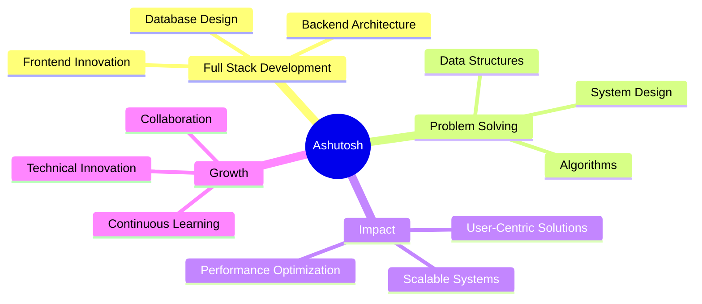

<div align="center">
  
# 👋 Hi, I'm Ashutosh Patro


[](ashutoshpatro.vercel.app)
[](https://www.linkedin.com/in/ashutosh-patro-2054b7239)
[](mailto:patroashutosh652@gmail.com)
[](github.com/ashutoshpatrodevops)

</div>

---

## 🚀 About Me

```typescript
const ashutosh = {
    location: "Berhampur, Odisha 📍",
    education: "B.Tech CSE @ NIST University 🎓",
    year: "Final Year (2022-2026)",
    cgpa: "9.33/10 ⭐",
    rank: "Top 10 in Academics 🏆",
    passion: "Building user-centric technological solutions",
    currentFocus: "Full Stack Development,DevOps & Problem Solving",
    availability: "Open to opportunities 🌟"
};
```

💡 **Driven by innovation** | 🎯 **Focused on impact** | 🌱 **Continuous learner**

---

## 💻 Tech Stack

### Languages
<p>
  
  
  
  
</p>

### Frontend
<p>
  
  
  
  
  
</p>

### Backend
<p>
  
  
</p>

### Database
<p>
  
  
</p>

### Tools & Platforms
<p>
  
  
  
  
</p>

---

## 🎯 Featured Projects

<table>
<tr>
<td width="50%">

### 🏛️ MuseMate
**Museum Ticket Booking Platform**


**Key Features:**
- 🔐 Secure session-based authentication
- 💳 Payment integration
- 🤖 AI chatbot (Sahayak) for recommendations
- ⚡ 30% faster load times

**Impact:** Streamlined museum ticketing experience with role-based dashboards

</td>
<td width="50%">

### 📝 TechPulse
**Full Stack Blog Platform**


**Key Features:**
- 📄 Rich Text Editor with CRUD operations
- 👤 User authentication & role-based access
- 🔍 Advanced search & filtering
- 💬 Interactive commenting system

**Impact:** Responsive blog platform with enhanced user engagement

</td>
</tr>
<tr>
<td width="50%">

### 🏥 KerMedix
**Healthcare Management Platform**


**Key Features:**
- 🏥 Digital health records for migrant workers
- 👨‍⚕️ Multi-role authentication system
- 📧 Automated email notifications
- 📱 Mobile-first responsive design

**Impact:** 60% reduction in administrative tasks, 30% improved performance

</td>
<td width="50%">

<br/>

### 🚀 Want to see more?

Check out my repositories for more exciting projects!

[](YOUR_GITHUB_LINK)

</td>
</tr>
</table>

---

## 📊 GitHub Stats

<div align="center">
  


</div>

<div align="center">
  


</div>

---

## 🎓 Education & Achievements

<table>
<tr>
<td>

**🎓 NIST University**  
*B.Tech in Computer Science and Engineering*  
📅 2022 - 2026 | 📍 Berhampur, Odisha

- 📈 **CGPA:** 9.33/10
- 🏆 **Rank:** Top 10 in Academics
- 🏅 **Represented university** in Hackathons and Technical Fests

**📚 Relevant Coursework:**
- Data Structures & Algorithms
- Database Management Systems
- Operating Systems
- Computer Networks
- Software Engineering

</td>
</tr>
</table>

---

## 🌟 What Drives Me

<div align="center">



</div>

---

## 📫 Let's Connect!

<div align="center">

I'm always excited to collaborate on innovative projects and discuss technology!

<p>
  <a href="mailto:patroashutosh652@gmail.com">
    
  </a>
</p>

<p>
  <a href="ashutoshpatro.vercel.app">
    
  </a>
  <a href="https://www.linkedin.com/in/ashutosh-patro-2054b7239">
    
  </a>
</p>

**📍 Location:** Berhampur, Odisha  
**📱 Phone:** +91 7847810210

</div>

---

<div align="center">

### 💭 Quote I Live By

*"The only way to do great work is to love what you do."* - Steve Jobs

---


**⭐ From [Ashutosh Patro](YOUR_GITHUB_LINK) | Building the future, one commit at a time 🚀**

</div>
